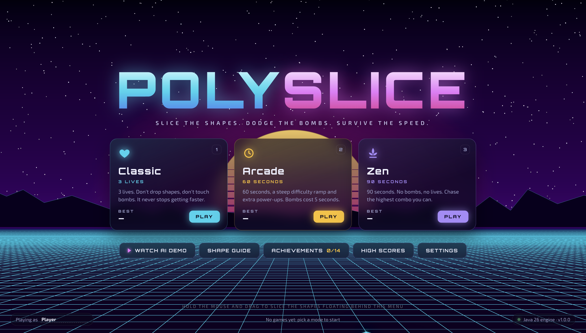
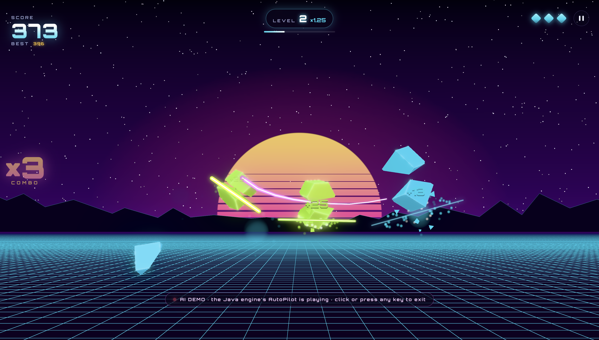
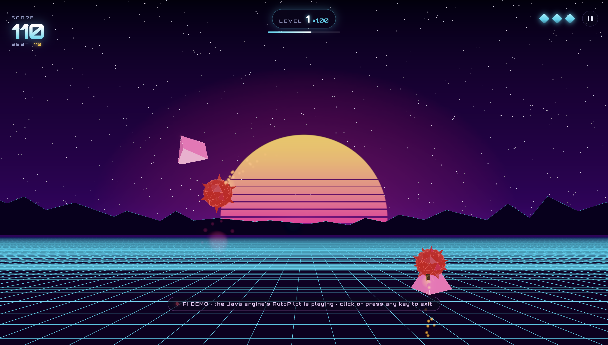
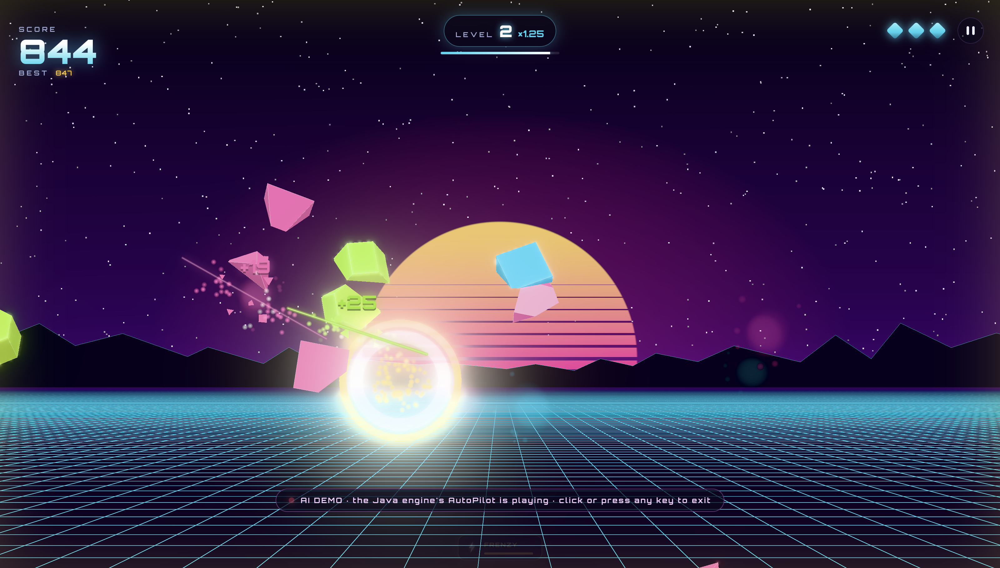
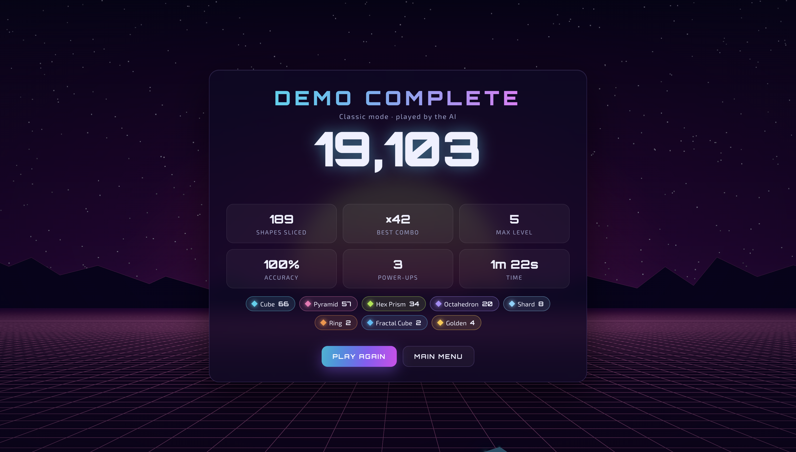
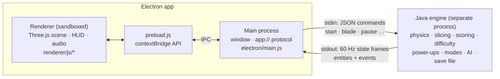

# PolySlice

**A neon, Fruit Ninja-style shape slicer. The game engine is written in Java, and it drives a 3D Electron + Three.js front end.**

Slice cubes, pyramids, prisms, rings and gems out of the air. Don't drop them, and don't touch the bombs. The game gets faster every 20 seconds, and every level raises the point multiplier, so surviving longer is how you get the big scores.



| Combos and slashes | Bombs |
| --- | --- |
|  |  |
| **Power-ups (Frenzy)** | **Results screen** |
|  |  |

---

## Features

### Shapes and point values
Each shape is defined once in the Java `ShapeType` enum. Rarer, smaller or more complex shapes are worth more, and advanced shapes only start spawning at higher levels.

| Shape | Base points | Appears from | Notes |
| --- | ---: | :---: | --- |
| Cube | 10 | Level 1 | The classic |
| Pyramid | 15 | Level 1 | |
| Hex Prism | 20 | Level 2 | |
| Octahedron | 25 | Level 3 | |
| Fractal Cube | 40 | Level 3 | Shatters into 4 bonus **Shards** (15 each) |
| Ring (torus) | 35 | Level 4 | |
| Dodecahedron | 50 | Level 5 | |
| Gem (icosahedron) | 75 | Level 6 | Small, fast and iridescent |
| **Golden** variant | ×5 | Any | 2% → 5% chance on any shape |

### Difficulty that keeps climbing, with points to match
Everything is driven by one "difficulty clock" (`Difficulty.java`):

- **Level** goes up every 20 s, and the **point multiplier** goes up with it: ×1.00, ×1.25, ×1.50, …
- **Intensity** `1 − e^(−t/100)` rises smoothly toward 1 and controls:
  - time between waves: 1.55 s → 0.42 s
  - wave size: 1–2 → up to 6 objects
  - bomb chance: 7% → 24% (no bombs in the first 6 s)
  - launch speed: up to 1.42×, with gravity scaled by speed², so arcs stay on screen but play out faster
- Higher-value shapes become more common as the level rises (`ShapeType.weightAt(level)`).
- The world reacts too: the grid speeds up, the backdrop palette shifts from cyan to violet, pink, orange and red, and the music tempo rises.

**Scoring:** `points = base × golden(5×) × level multiplier × Double Points(2×)`.
**Combos:** slicing 3 or more shapes in one swipe adds `10 × n(n−1)/2` × multipliers (a 6-combo is +150).

### Power-ups (special shapes)
| Power-up | Duration | Effect |
| --- | :---: | --- |
| ❄ Freeze | 6 s | World runs at 40% speed (timers run on real time, so Freeze can't extend itself) |
| ⚡ Frenzy | 5 s | Shapes stream in from both sides, no bombs, and dropped ones are free |
| 2× Double Points | 8 s | Every point counts twice |
| ⚔ Mega Blade | 7 s | Much bigger hitbox, except on bombs |
| 🛡 Shield | 15 s | Blocks the next bomb or dropped shape |
| ♥ Extra Life | instant | +1 life (Classic) or +5 s (timed modes) |
| ✺ Nova | instant | Slices every shape on screen. Huge combos. |

### Modes
- **Classic**: 3 lives. Dropping a shape or hitting a bomb costs a life. No time limit.
- **Arcade**: 60 seconds, a 2.5× faster difficulty ramp, extra power-ups. Bombs cost 5 seconds.
- **Zen**: 90 seconds, no bombs, no lives. Chase combos.
- **AI Demo**: the Java `AutoPilot` plays Classic by itself, using the same blade API a person uses. Good for presentations.

### Other extras
- **14 achievements** with in-game toasts, a **top-10 leaderboard per mode** and lifetime stats, all saved by the engine.
- **Real-time mesh cutting:** sliced shapes split into two halves along the exact blade angle, using per-half clipping planes with a glowing cut face.
- Bloom, particle sparks, tumbling shards, shockwave rings, screen shake and an animated synthwave sun, mountains and grid.
- **Procedural audio:** every sound effect and the soundtrack are synthesized live with the Web Audio API. There are no audio files.
- Settings for volume, blade color (including rainbow), hold-to-slice vs. always-on blade, graphics quality, screen shake and an FPS counter.
- The menu background is a live, sliceable attract mode.

---

## Architecture



**The Java engine is the single source of truth.** It runs a fixed 60 Hz simulation and decides every rule: what spawns, what got sliced, how many points it was worth, whether you lost a life. The Electron UI is a pure view. It sends pointer samples and renders whatever the engine reports. That gives a clean Model/View split, and it means all the rules can be unit-tested with no UI.

**How the 2D engine lines up with the 3D view:** the camera is set up with an off-axis projection so that the `z = 0` plane maps exactly onto the window (`x ∈ [0, width]`, `y ∈ [0, 1000]`). The engine works in plain 2D world units, while the renderer draws real 3D meshes on that plane. The two always agree on where everything is.

**Smooth motion at any refresh rate:** each state frame carries positions, velocities, gravity and the engine clock. Between frames, the renderer extrapolates with the same ballistic formula the engine uses, so motion stays smooth on 60 Hz and 120 Hz displays.

### Java design (`engine/src/main/java/com/polyslice`)
| Package | What's inside | Concepts on display |
| --- | --- | --- |
| `entity` | `Entity` (abstract) → `Shape`, `Bomb`, `PowerOrb`; `ShapeType` enum | Inheritance and **polymorphism**: each entity decides what `onSliced` / `onMissed` means |
| `mode` | `GameMode` → `Classic`, `Arcade`, `Zen`, `Attract` | **Strategy pattern**: modes plug in their own penalties, timers and win conditions |
| `game` | `GameSession`, `Spawner`, `Difficulty`, `Blade`, `ComboTracker`, `Scoring`, `GameStats` | Fixed-timestep simulation, deterministic per seed |
| `game.GameEvent` | `sealed interface` with `record` implementations | Sealed types and records (Java 17) |
| `powerup` | `PowerUpType` enum, `PowerUpManager` (`EnumMap` of timers) | Enums with data and behavior |
| `persist` | `SaveData`, `HighScoreTable`, `Achievement` (enum of `Predicate`s), `AchievementTracker` | Lambdas; atomic file writes (temp file + rename) |
| `ai` | `AutoPilot` | Target selection, path planning around bombs |
| `engine` | `EngineServer` | **Concurrency**: a stdin reader thread feeds a `ConcurrentLinkedQueue`, and one loop thread owns all game state |
| `json` | Hand-written `Json` parser and `JsonWriter` | Recursive-descent parsing, zero dependencies |

The engine has **no third-party dependencies**: just the JDK.

### Engine protocol (one JSON object per line)
| UI → engine | Purpose |
| --- | --- |
| `{"cmd":"hello"}` | Request the catalog, high scores and achievements, and reset to the menu |
| `{"cmd":"start","mode":"CLASSIC","player":"Ada","demo":false}` | Start a game |
| `{"cmd":"blade","pts":[[x,y,tMillis],…]}` / `{"cmd":"bladeUp"}` | Blade samples (coalesced pointer events) / stroke ended |
| `pause` · `resume` · `menu` · `end` · `resize` · `resetData` · `quit` | Flow control |

| Engine → UI | Purpose |
| --- | --- |
| `{"type":"hello",…}` | Shape and power-up catalog, modes, rules, high scores, achievements, lifetime stats |
| `{"type":"state",…,"e":[[id,code,x,y,vx,vy,flags]…],"ev":[…]}` | 60 Hz frame: HUD values, entities, and events (`slice`, `combo`, `bomb`, `miss`, `power`, `level`, `achievement`, `gameOver`, …) |

You can drive the engine by hand: `java -jar engine/build/polyslice-engine.jar`, then type `{"cmd":"hello"}`.

---

## Getting started

**To play:** download the macOS `.dmg` or a Windows `.exe` from this repo's **Releases** page, or build them yourself (below). Neither needs Java installed.

**To build or run from source:** macOS or Windows, [Node.js](https://nodejs.org) 22.12+, and a JDK 17+ (for example `brew install openjdk` on a Mac).

```bash
npm install
npm start
```

`npm start` compiles the Java engine with `javac` (no Maven or Gradle needed), then launches Electron. Electron downloads its own binary the first time it runs.

### Build a standalone macOS app
```bash
npm run dist
```
This produces `dist/PolySlice-1.0.0-arm64.dmg`. The app bundles a minimal Java runtime made with `jlink` (about 30 MB), so whoever installs it **doesn't need Java**.

- The bundled runtime matches the CPU of the Mac that builds it, so build on an Intel Mac to get an Intel version.
- The app isn't code-signed. If someone downloads it, macOS blocks the first launch. They can allow it in **System Settings → Privacy & Security → Open Anyway**, or run `xattr -cr /Applications/PolySlice.app`.

### Build for Windows
```bash
npm run dist:win
```
This works from a Mac too; no Windows machine or Wine is needed. It downloads a Windows Java runtime (Eclipse Temurin 21 JRE from Adoptium, about 49 MB), checks its published SHA-256 checksum, bundles it, and produces two files in `dist/`:

| File | Use it when |
| --- | --- |
| `PolySlice-Setup-1.0.0.exe` | You want a normal install with Start menu and desktop shortcuts. It also starts the fastest. |
| `PolySlice-1.0.0-portable.exe` | You want one file to share: double-click and play, nothing to install. It unpacks itself each launch, so it takes a few extra seconds to start. |

Both are 64-bit and need Windows 10 or 11. Players don't need Java. The `.exe` files aren't code-signed, so Windows SmartScreen shows "Windows protected your PC" the first time. Click **More info → Run anyway**.

`npm run dist:all` builds the macOS DMG and both Windows files in one go.

### Tests
```bash
npm run test:engine   # 50 Java unit/integration tests (custom annotation-based runner)
npm run test:e2e      # 10 end-to-end checks: real mouse drags through the live app
npm test              # both
```
The end-to-end test launches the real app, slices shapes with OS-level mouse events, and checks the scoring, pause, results screen, high-score save, achievements and guide. It uses a throwaway save folder.

### Other scripts
| Script | What it does |
| --- | --- |
| `npm run dev` | Start with DevTools open |
| `npm run screenshots` | Regenerate everything in `docs/screenshots/` (plays an AI demo and captures key moments) |
| `npm run icon` | Re-render `assets/icon.png` |
| `npm run build:jre` | Build only the bundled macOS Java runtime |
| `npm run fetch:jre-win` | Download only the bundled Windows Java runtime |

---

## Controls
| Input | Action |
| --- | --- |
| Hold mouse / trackpad and drag | Slice (switch to "Always on" in Settings for a hover blade) |
| `1` `2` `3` / `Enter` | Start Classic / Arcade / Zen from the menu |
| `Esc` / `P` | Pause / resume |
| `F` | Fullscreen |
| `M` | Mute |

---

## Project structure
```
engine/                 Java game engine (the rules)
  src/main/java/com/polyslice/
    Main.java           entry point (--data-dir)
    engine/             stdin/stdout server and 60 Hz loop
    game/               session, spawner, difficulty, scoring, blade, combos
    entity/             Entity hierarchy and ShapeType
    mode/               Classic / Arcade / Zen / Attract strategies
    powerup/            power-up types and timers
    persist/            save file, high scores, achievements
    ai/                 AutoPilot (AI demo)
    json/               zero-dependency JSON parser and writer
  src/test/java/        50 tests and a tiny reflection-based test runner
electron/               main process, engine process manager, preload bridge, e2e test
renderer/               UI: index.html, css/, js/ (Three.js stage, effects, HUD, screens, audio)
scripts/                build-engine, build-jre, fetch-jre-win, vendor, csp-hash, make-icon
assets/icon.png         app icon
docs/screenshots/       images used in this README
```

## Credits
- [Three.js](https://threejs.org) (MIT) for 3D rendering and post-processing
- [Orbitron](https://fonts.google.com/specimen/Orbitron) and [Exo 2](https://fonts.google.com/specimen/Exo+2) fonts (SIL Open Font License) via Fontsource
- [Electron](https://www.electronjs.org) and [electron-builder](https://www.electron.build)

Licensed under the MIT License (see [LICENSE](LICENSE)).
